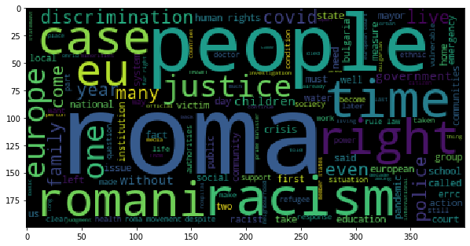
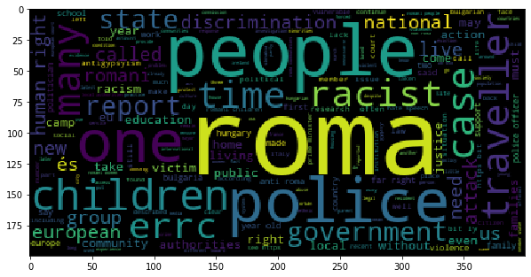

## Roma Analysis

### Data
The data is scraped from <a href = "http://www.errc.org/"> ERRC(European Roma Right Center)</a> and only the news portal is scraped. There is a function in the errc_news.py which scrapes the website with BS.

<h5> This is for 2 pages </h5>
 </img>

<h5> This is for 10 pages </h5>
 </img>

